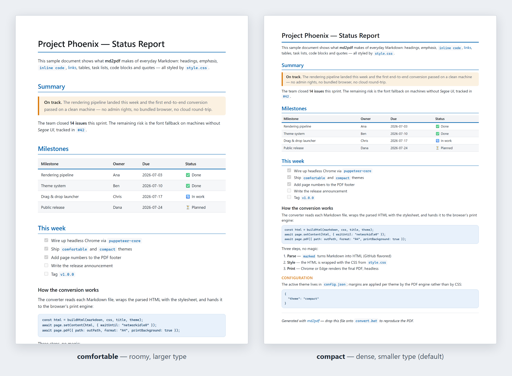

# md2pdf

[](https://github.com/pawagit/md2pdf/actions/workflows/ci.yml)
[](LICENSE)
[](https://nodejs.org)

Drag-and-drop Markdown → PDF converter for Windows.
Uses the Chrome or Edge you already have — no admin rights, no bundled browser, no cloud.



## Why md2pdf?

- **Drag & drop** — drop `.md` files onto `convert.bat`; the PDFs appear next to them
- **Zero admin footprint** — plain `npm install`; `puppeteer-core` reuses your system
  Chrome/Edge instead of downloading Chromium, so it also works on locked-down company machines
- **Offline & private** — your files never leave your machine
- **Print-quality output** — A4, page numbers, an optional "last saved" timestamp,
  smart page breaks, GitHub-flavored Markdown (tables, task lists, heading
  anchors), images — local and web
- **Fully styleable** — two built-in themes; every color and size is a CSS variable in `style.css`

## Requirements

| Requirement | Notes                                             |
| ----------- | ------------------------------------------------- |
| Windows     | Tested on Windows 10/11                           |
| Node.js 22+ | Check with `node --version`                       |
| Browser     | Chrome **or** Edge (Edge ships with Windows)      |

## Installation

```sh
git clone https://github.com/pawagit/md2pdf.git
cd md2pdf
npm install
```

That's it — no global installs, no admin rights. If you don't use git,
[download the ZIP](https://github.com/pawagit/md2pdf/archive/refs/heads/main.zip)
and run `npm install` in the extracted folder.

## Usage

### Option A — Drag & drop

Drag one or more `.md` files onto **`convert.bat`**.
The PDF appears next to each input file.

### Option B — Command line

```bat
node convert.js path\to\file.md
node convert.js file1.md file2.md file3.md
```

### Option C — From the VS Code terminal

Open the integrated terminal, navigate to this folder, and run:

```bat
npm run convert -- ..\path\to\notes.md
```

Try it right away with the bundled example:

```bat
node convert.js examples\sample.md
```

## Placing `convert.bat` elsewhere (Desktop, taskbar, Send To …)

`convert.bat` finds the converter through the `CONVERTER` variable near the
top of the file. By default it points next to the `.bat` itself (`%~dp0`
expands to the folder the `.bat` file sits in), so while the two files stay
together there is nothing to configure:

```bat
set "CONVERTER=%~dp0convert.js"
```

To move the `.bat` somewhere handier (Desktop, taskbar, Send To menu) while
the project stays put, change that line to the full path of `convert.js`:

```bat
set "CONVERTER=C:\path\to\md2pdf\convert.js"
```

If you forget, no harm done — the `.bat` prints exactly this instruction
instead of failing with a cryptic Node error.

Either way, each PDF is written next to its source `.md` file — drag & drop
and command-line use both keep working, independent of the current directory.

> **Tip:** Copy `convert.bat` into `%APPDATA%\Microsoft\Windows\SendTo` (with
> `CONVERTER` set to the full path) and you can right-click any `.md` file →
> **Send to → convert** from Explorer.

## Themes (font size & density)

Two stylesets ship in `style.css`, selected in **`config.json`**:

| Theme         | Look                                              |
| ------------- | ------------------------------------------------- |
| `comfortable` | Roomy — larger type, wider margins                |
| `compact`     | Smaller type, tighter spacing & margins (default) |

To switch, edit the `theme` line in `config.json` and re-run the conversion:

```json
{
  "theme": "compact"
}
```

Both themes share the same brand colours — a blue primary (`#0062ad`) paired
with a complementary warm amber secondary (`#d97706`), on neutral grey
surfaces. The difference between themes is purely typography, spacing, and page
margins.

- **Type & spacing** live in `style.css` as CSS variables: `:root` holds the
  `comfortable` sizes, and `body.compact { … }` overrides them. `convert.js`
  puts the theme name as a class on `<body>`, so the right block wins
  automatically.
- **Page margins** live in `config.json` under `themes.<name>.margin` (margins
  are applied by the PDF engine, not CSS).

## PDF footer (page numbers & timestamp)

Every page gets a footer with a centered page number. The bottom-left corner
can additionally carry a timestamp, so you can tell which version of the
Markdown a PDF reflects — configured in `config.json`:

```json
{
  "footer": { "timestamp": "modified" }
}
```

| Value       | Footer shows                                                         |
| ----------- | -------------------------------------------------------------------- |
| `modified`  | `Last saved 2026-07-15 14:32` — when the source `.md` was last saved |
| `generated` | `Generated 2026-07-15 16:05` — when the PDF was created              |
| `both`      | `Saved 2026-07-15 14:32 · PDF 2026-07-15 16:05`                      |
| `none`      | Page numbers only                                                    |

The shipped `config.json` uses `modified`; without a `footer` entry no
timestamp is printed. The "last saved" time is the file's modification date
on disk — exactly what you want for "which version is this PDF?", though be
aware that copying files or checking them out from git can rewrite it. (The
PDF's creation time is always embedded in its metadata anyway, visible in the
file properties.)

## Customising the look

Edit **`style.css`** to change fonts, colors, spacing, etc.
Changes take effect on the next conversion — no rebuild needed.

The colours and sizes are defined once as **CSS variables** at the top of the
file (the `:root` and `body.compact` blocks). Change a token there and every
rule using it follows — no need to hunt through individual selectors.

Key things you might want to tweak:

| What             | Where                                    |
| ---------------- | ---------------------------------------- |
| Primary accent   | `style.css` → `--accent`                 |
| Secondary accent | `style.css` → `--accent-secondary`       |
| Body font        | `style.css` → `body { font-family … }`   |
| Body font size   | `style.css` → `--font-size` (per theme)  |
| Code block theme | `style.css` → `--code-bg` / `--code-fg`  |
| Page margins     | `config.json` → `themes.<name>.margin`   |
| Active theme     | `config.json` → `theme`                  |
| Footer timestamp | `config.json` → `footer.timestamp`       |
| Page size        | `convert.js` → `format:`                 |

## How it works

1. **[marked](https://github.com/markedjs/marked)** parses the Markdown into HTML
   (with GitHub-style heading IDs via
   [marked-gfm-heading-id](https://github.com/markedjs/marked-gfm-heading-id))
2. The HTML is wrapped with `style.css`
3. **[puppeteer-core](https://pptr.dev/)** opens your system Chrome/Edge in headless mode
4. Chrome's print-to-PDF engine renders the final PDF

Because it uses `puppeteer-core` (not `puppeteer`), it does **not** download a
separate Chromium — it reuses whatever browser is already on your machine.

## Project layout

| File          | Purpose                                            |
| ------------- | -------------------------------------------------- |
| `convert.js`  | The converter (Node.js, ~190 lines, no build step) |
| `convert.bat` | Drag-and-drop launcher for Windows                 |
| `style.css`   | All styling — themes, colors, typography           |
| `config.json` | Active theme + per-theme page margins              |
| `examples/`   | Sample document to test the conversion             |

## Troubleshooting

| Problem | Fix |
| ------- | --- |
| `Could not find Chrome or Edge` | Install Chrome or Edge, or add your browser's path in `convert.js` → `findBrowser()` |
| `node is not recognized` | Install Node.js (LTS) from [nodejs.org](https://nodejs.org) or ask IT |
| PDF not written / "file in use" | Close the PDF in your viewer before re-converting — Windows locks open files |
| Fonts look wrong in the PDF | Edit `style.css` to use fonts installed on your machine |
| Want Letter size, not A4 | In `convert.js`, change `format: "A4"` to `format: "Letter"` |

## Contributing

Issues and pull requests are welcome. If you plan a bigger change, please open
an issue first to discuss it.

## License

[MIT](LICENSE) © [pawa](https://pawa.ch)
